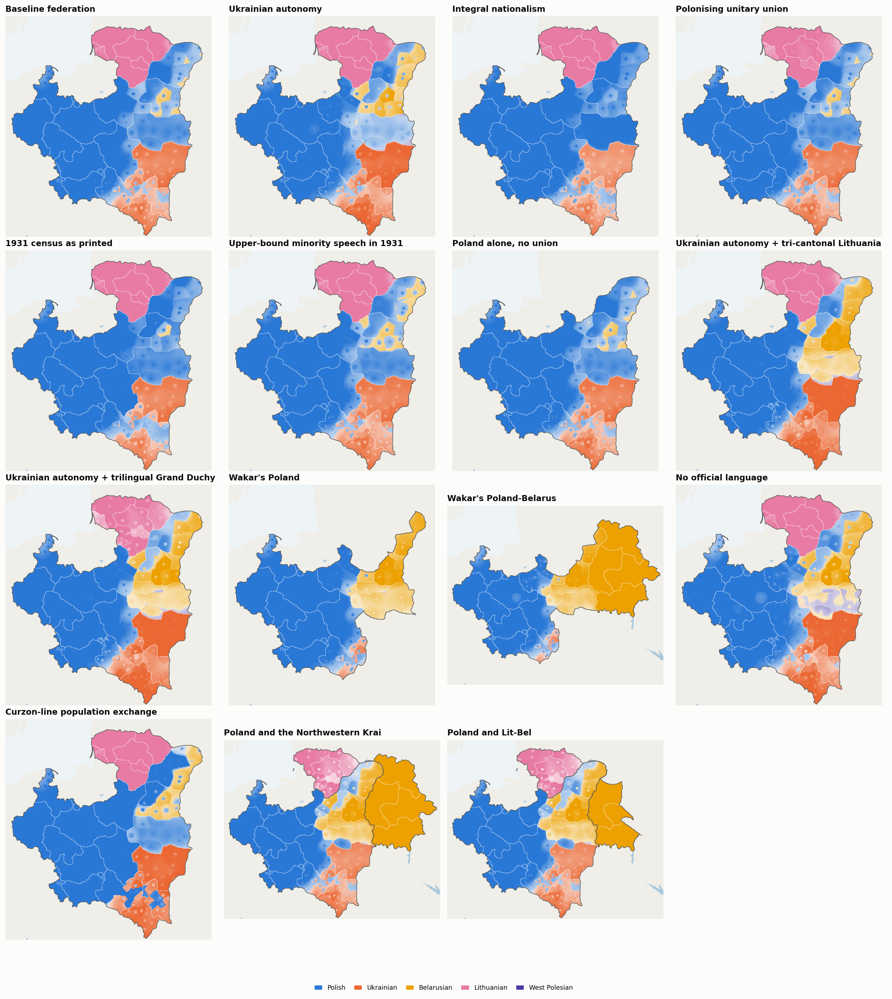
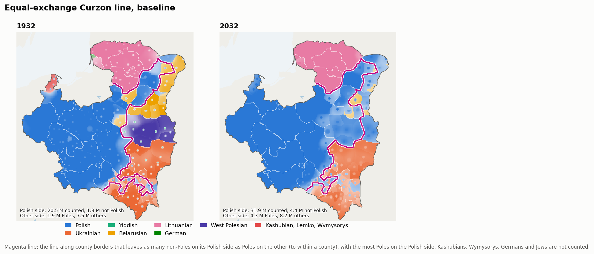

# plsim: Poland-Lithuania without the Second World War, 1932-2032

`plsim` is a coupled simulation of a surviving interwar Polish state (by
default in a federal union with Lithuania) in a world with no Second World
War. It models four things together:

* **Demography**: cohort-component projection by region, urban/rural,
  ethno-confessional community, language, sex and single year of age.
* **Migration**: rural-urban, inter-regional and international flows,
  including planned eastern settlement and Jewish and German emigration
  channels.
* **Language and identity**: intergenerational and adult language shift
  (history-matched to documented cases), bilingualism, extinction of small
  languages, national identity tracked apart from home language, and what
  different censuses *would have recorded*.
* **Infrastructure**: endogenous growth of the railway and road networks
  under budgets, cost-benefit appraisal and the dated 1930s projects and 1939
  plans.

The simulation starts from the census of 9 December 1931, is back-validated
against the registered statistics of 1932-1939, and then runs forward without
the war. It is a counterfactual *simulation*, not a forecast. Each component
uses a published model structure; see `docs/METHODOLOGY.md` for equations,
calibration, sources and limitations.

## Quick start

```bash
pip install -r requirements.txt
python -m plsim list                    # scenarios
python -m plsim run baseline            # one seeded run -> outputs/runs/baseline/*.csv (+ validation)
python -m plsim validate baseline       # 1932-39 back-validation and plausibility checks
python -m plsim census                  # 1931 census-reconstruction consistency test
python -m plsim ensemble baseline -n 32 # Monte-Carlo ensemble -> outputs/ensemble_baseline/*.csv
python -m plsim report -n 32            # all scenarios + ensembles + figures + outputs/report.html
python -m plsim maps                    # 3.5 km maps, GIF animations and the interactive atlas (outputs/atlas/)
python -m plsim calibrate               # history matching of the language-shift rates (outputs/calibration/)
pytest -q                               # 90 tests
```

A 100-year county-level run takes about 4 minutes (20 s for the
23-voivodeship model, `partition: []`). `maps` runs the scenarios four at a
time and caches the runs; `report` reuses them and adds the 32-member
ensemble (each member also downscaled for the probability maps), about
two hours in all on 4 cores. Run `report` before `maps`, so that the atlas
gets the ensemble certainty layer.

## What is modelled

| Area | Model | Main references |
|---|---|---|
| Starting population | 1931 census cross-read with religion; Lithuania 1923/1925 censuses; three reconstructions of the latent vernacular; 1897 imperial census anchors | GUS 1931; Tomaszewski 1985; Kubijovyč 1983; 1897 census |
| Mortality | Siler age pattern with a health-progress index; best-practice-gap level with a post-1945 catch-up jump | Oeppen & Vaupel 2002; Preston 1975; Raftery et al. 2013 |
| Fertility | three-phase TFR model (double-logistic Phase II, AR(1) Phase III), pace driven by modernisation and community | Alkema et al. 2011; Coale & Watkins 1986 |
| Migration | Rogers-Castro age schedules; income-driven urbanisation; spatial interaction over *network* travel times; migration hump | Rogers & Castro 1981; Wilson 1971; Harris & Todaro 1970; Hatton & Williamson 1998 |
| Language | multi-language Abrams-Strogatz attraction with a bilingual state, vertical and horizontal transmission, enclave concentration, institutional completeness and a diaspora floor; rates history-matched to Masuria, Carinthia, Wales, Posen and second-generation immigrants | Abrams & Strogatz 2003; Minett & Wang 2008; Kandler et al. 2010; Breton 1964; Alba et al. 2002; Vernon et al. 2010 |
| Identity | national identity by county and group, apart from home language: births, switches, nation-building, the pull of the state nation; nationality censuses read identity, mother-tongue censuses read language | Hroch 1985; Weber 1976 |
| Networks | ~190-node multimodal graph; gravity demand; rule-of-half appraisal with the exact single-edge update; running costs and partial local benefit for expressways and motorways (calibrated to European densities); budgets; dated historical and planned projects; Beeching-type closures | Yerra & Levinson 2005; Louf et al. 2013; Donaldson & Hornbeck 2016 |
| Economy (driver) | conditional convergence to a western frontier; regional A/B gradient; COP and Fifteen-Year Plan; Gompertz motorisation | Barro & Sala-i-Martin 1992; Dargay & Gately 1999 |

## Census unreliability, the imperial census and the Lauda question

The 1931 census is itself contested evidence, so the model keeps *what people
spoke at home* separate from *what a census printed*.

* **Starting points** (`census_variant`). Every scenario starts from the
  research estimate unless it says otherwise:
  * `religion_corrected`: the **baseline**, Tomaszewski's (1985) correction.
    It counts Greek Catholics and Orthodox recorded as Polish-speaking as
    Ukrainian or Belarusian, and reproduces his figures: 64.7 % ethnic Poles,
    5.1 M Ukrainians and 1.95 M Belarusians (with the "tutejszy"), 0.78 M
    Germans, 3.11 M Jews.
  * `official`: the 1931 census as printed (scenario `census_official`).
  * `vernacular`: the upper bound for minority speech (scenario
    `census_vernacular`). It adds Kubijovyč's (1983) Latin-rite Ukrainians
    (5.85 M Ukrainians in all) and Catholic Belarusian speech at 1897
    proportions.
* **Lithuania's Polish-speakers** (`lt_variant`): ~150 k in the baseline,
  the middle of the published range. The 1923 census gave 65.6 k, and the
  Polish electoral committee claimed ~202 k in 1923 (held "very probable" by
  Buchowski 1999). The 1897 Kovno governorate had a ~9 % Polish share.
* **Sources and comparison** with the literature: `docs/DATA_SOURCES.md`, "The
  1931 starting point".
* **Census observation model.** It re-expresses any latent state as a
  1931-type Polish census, the 1897 imperial census, the 1923 Lithuanian
  census or a modern self-identification census would have recorded it.
  Passing the baseline through the 1931 regime reproduces the printed
  national shares within 1 point in total (Polish 68.7 % against 68.9 %).
  In other words, the published census is consistent with a considerably less
  Polish-speaking population.
* **Lauda** (Kėdainiai-Panevėžys-Ukmergė-Raseiniai) is its own unit. The
  Polish-speaking petty gentry there are followed through every scenario:
  in the federal baseline Polish is co-official in Lithuania, and under a
  `polonizing_union` it is the only official language.

## Headline results (baseline, 32-member ensemble)

Medians, with 5-95 % ranges in brackets. The whole union is the 17 Polish
first-order units plus 6 Lithuanian units (270 counties). The language rates
are history-matched (METHODOLOGY §6.4), and the ensemble draws them jointly
from the set the matching did not rule out.

| Year | Population (M) | TFR | e0 m / f | Urban % | GDP/head (1990 GK$) |
|---|---|---|---|---|---|
| 1939 | 37.1 (Poland 34.5) | 3.24 | 50.5 / 54.2 | 29 | 2,070 |
| 1960 | 43.7 [42.6-46.0] | 2.86 | 59.4 / 64.3 | 40 | 3,930 |
| 1990 | 49.9 [45.8-54.9] | 1.90 | 67.6 / 74.1 | 58 | 9,700 |
| 2032 | 48.9 [42.1-56.8] | 1.58 | 79.1 / 84.0 | 67 | 18,500 |

**Demography**

* The population peaks at ~51 M around 2010.
* The Polish voivodeships alone reach ~47 M (the Second Republic alone:
  46 M in its seeded run).
* Net emigration of ~100-120 k/yr in the guest-worker era falls to ~30-60
  k/yr after 2000; net immigration appears only in the high-convergence
  runs.

**Languages** (home vernacular, shares of the whole union, from the research
start of 1931)

| Language | 1933 | 2032 |
|---|---|---|
| Polish | 61.3 % | 67.0 % |
| Ukrainian | 14.1 % | 15.3 % (7.5 M speakers [6.1-9.0]) |
| Yiddish | 8.3 % | 4.1 % |
| Belarusian | 3.9 % | 3.0 % |
| Lithuanian | 5.7 % | 4.1 % |
| West Polesian | 2.1 % | 1.6 % |

* **Ukrainian** grows faster than the population: high Galician and
  Volhynian fertility and robust Greek Catholic institutions. Migrants'
  children now assimilate (the diaspora term): Warsaw city ends 8 %
  Ukrainian-speaking in the seeded run, against 13 % before the
  calibration.
* **Yiddish** declines among acculturating Jews and survives through a
  growing Haredi population (very uncertain). Jewish *identity* (7.1 % of
  the union in 2032) outlasts Yiddish (4.1 %).
* **Kashubian**: 200 k -> 76 k [49-115 k]. **Lemko**: 132 k -> 64 k
  [46-93 k]. Both fall faster than before the calibration, which raised the
  shift of same-faith minorities and the speed at which schools teach Polish.
* **West Polesian**: persists in villages (0.8 M) as a declining share.
* **Wymysorys**: 1,500 -> ~65 speakers [14-102], moribund even without the
  post-war ban.
* **Karaim**: ~680 -> ~220 speakers.

**Identity** (separate from home language): Polish 63 -> 64 %, Ukrainian
12 -> 16 %, Belarusian 2.2 -> 3.4 %, "local" 4.0 -> 2.7 %, Jewish 8.1 ->
7.1 %. Polish identity trails Polish speech (64 % against 67 % in 2032),
because many who switch to Polish keep a Ukrainian, Belarusian or Jewish
identity.

**Infrastructure**

* Almost all inter-town roads are paved by ~1960.
* By 2032: ~1,900 km of motorway and ~6,700 km of expressway (19 km per
  1000 km², near Czechia and Hungary; 23,800 km before the road appraisal
  counted running costs and only part of the local traffic). Also ~10,300 km
  of electrified main line and ~1,800 km of high-speed line.
* The 1939 plans are completed in the early 1940s: the Wilno-Gdynia shortcut
  Łapy-Ostrołęka-Przasnysz-Mława, Dębica-Jasło, and the COP Łódź-Dębica
  trunk.

**Uncertainty on the map.** Every ensemble member is downscaled. In 2032,
about one cell in twenty has a leading language that fewer than 80 % of runs
agree on. These cells lie on the Belarusian-Polish frontier in the
north-east and in the mixed Polish-Ukrainian belt of western Galicia
(`outputs/maps/map_uncertainty.png`, and the atlas's Certainty layer).

## Maps: language shift and population on a 3.5 km grid

`python -m plsim maps` downscales every scenario to about 37,500 cells of
3.5 x 3.4 km and draws the result:

* **Interactive atlas**: `outputs/atlas/index.html`.
  * **Scenarios and layers.** A time slider, all 13 scenarios, and six
    layers:
    * plurality language;
    * one language (optionally as change since 1932);
    * national identity (by county);
    * density;
    * growth;
    * ensemble certainty (baseline): the most likely leading language in
      1982 or 2032, paler where the 32 runs disagree.
  * **Zoom and pan.** Scroll, pinch, the buttons or the keyboard (+, −,
    0, arrows) zoom up to 24×; drag to pan. County borders are drawn
    throughout, and county names and smaller towns appear as you zoom in.
  * **Overlays and readout.** It overlays the railway and road network as
    it grows, with km by class and the latest openings. It dashes the
    borders between federal members (cantons, autonomies). It reads out
    any cell: county, voivodeship, member, official languages and home
    languages.
  * **Whole areas.** Click or tap to select the county, voivodeship or
    federal member (canton, autonomy) under the pointer: the panel shows its
    residents, growth since 1932, area, density and home languages, and the
    chart follows it.
  * **Curzon line.** An overlay draws, for every 5-year frame, a continuous
    line across the state along county borders that leaves as many
    non-Poles on its Polish side as Poles on its other side (to within a
    county), with the most Poles on the Polish side (details below and in
    `docs/METHODOLOGY.md` §12.8). A second overlay draws the historical Curzon line of 1919-20
    (line A), with the same people counted on either side.
* **Static maps and animations**: `outputs/maps/`, including
  `anim_languages.gif` and `anim_density.gif`.

How it works (details in `docs/METHODOLOGY.md` §12):

* **Territory.** The state borders are those of 1 January 1932, from
  CShapes 2.0 (Schvitz et al. 2022). Maps clip the cells to them, so the
  border is drawn as a line rather than in steps. Voivodeship and county
  borders inside are approximations (weighted Voronoi of the towns and
  county seats, calibrated to the official areas). Land left out of the
  state in a scenario (`exclude`) is drawn as foreign. Soviet Belarus (the
  BSSR of 1926; modern Belarus minus 1932 Poland, from Natural Earth) is a
  third state, used by Wakar's Poland-Belarus.
* **1932.** County anchors from the 1931 census, 25 of them county figures,
  the rest graded estimates, shape each voivodeship's languages inside its
  borders. Iterative proportional fitting keeps the regional totals exact.
* **Each year.** The region's net shift from the main model is placed with
  the neighbourhood rule of Prochazka & Vogl (2017, *PNAS*): speakers shift
  where the gaining language is spoken nearby (Gaussian kernel, 10 km),
  plus a constant institutional part. Towns spread their influence over a
  wider radius as they grow (Trudgill's hierarchical diffusion). Language
  islands therefore dissolve first, and contact zones retreat as fronts.
* **Population.** Rural cells near growing towns gain population and remote
  ones lose it, which gives suburban rings and rural exodus.


Baseline, area where each language leads (thousand km²):

| | Polish | Ukrainian | Lithuanian | Belarusian | West Polesian | Kashubian/Lemko |
|---|---|---|---|---|---|---|
| 1932 | 229 | 79 | 55 | 39 | 35 | 4 |
| 2032 | 302 | 76 | 56 | 10 | 0 | 0 |

* **Ukrainian** holds its Volhynian and Pokuttya core. It retreats from the
  San and the Lwów hinterland.
* **Belarusian and West Polesian** survive as minorities in the villages,
  but by 2032 Belarusian leads only a strip along the eastern border and
  West Polesian nowhere. They hold on where the state schools them or keeps
  out of language policy: `ukraine_autonomy_tricantonal`,
  `autonomy_grand_duchy_coofficial`, `wakar_poland` and
  `no_official_language` (where Belarusian leads 54 and West Polesian 21
  thousand km² in 2032).
* **Population.** Almost two-thirds of the land area has fewer people in
  2032 than in 1932, and a sixth has less than half. Growth concentrates
  in the cities, their suburban rings, and high-fertility Polesie and
  Volhynia.


## County level (powiaty)

Every scenario runs on 270 regions: the 1931 powiaty and the Lithuanian
apskritys, with Warsaw and Kaunas cities whole. One county, Węgrów, wins no
cell on the approximate voivodeship map and is merged into its neighbours.
`partition: []` runs the original 23-voivodeship model instead (20 s rather
than 4 minutes). Details are in `docs/METHODOLOGY.md` §12.6.

* **Data.** The 1931 county census by mother tongue covers the eight
  eastern voivodeships (97 counties, grade A). Lublin has county
  populations (grade B). The other counties have seats only and are
  downscaled from their voivodeship (grade C). County figures are fitted
  to the voivodeship totals of the starting point, so the county tables
  decide *where* speakers live and the research estimate decides *how many*.
* **Consistency.** Migration, income, enclave concentration and random
  numbers are nested in the voivodeships, so the county run reproduces
  the voivodeship model:

  | 2032 | Voivodeship run | County run |
  |---|---|---|
  | Population | 48.31 M | 48.21 M |
  | Ukrainian speakers | 9.06 M | 9.10 M |
  | Belarusian speakers | 1.92 M | 1.93 M |

* **What it adds is where.** In the baseline, 34 counties change their
  plurality language by 2032, all of them towards Polish except Klaipėda
  (German to Lithuanian):
  * Belarusian blocks: Grodno, Wołkowysk, Bielsk, Głębokie–Wilejka and
    Nieśwież–Słonim (12 counties);
  * all nine Polesie counties;
  * three Kashubian counties;
  * nine Ukrainian counties: eight of lwowskie (Sambor, Drohobycz, Sokal,
    Lesko ...) and Kamionka Strumiłowa.

  Lwów county grows from 460 k to 840 k people, Wilno from 415 k to 803 k.



## Scenarios (single seeded run each, 2032)

| Scenario | Population outside Lithuania (M) | Polish % | Ukrainian % | Yiddish % | Belarusian % | Lithuanian % | W. Polesian (k) |
|---|---|---|---|---|---|---|---|
| baseline | 46.2 | 69.2 | 16.5 | 3.8 | 3.2 | 4.1 | 849 |
| ii_rp_only | 46.3 | 72.0 | 17.4 | 4.0 | 3.4 | 0.1 | 870 |
| federal_autonomy | 46.1 | 62.0 | 19.2 | 4.5 | 5.1 | 4.2 | 1,469 |
| integral_nationalism | 45.7 | 73.9 | 14.7 | 3.1 | 2.3 | 4.1 | 455 |
| polonizing_union | 46.1 | 69.8 | 16.5 | 3.8 | 3.2 | 3.6 | 849 |
| census_official | 46.1 | 71.8 | 14.8 | 3.8 | 2.3 | 4.3 | 849 |
| census_vernacular | 46.2 | 68.2 | 17.0 | 3.8 | 3.8 | 4.1 | 849 |
| ukraine_autonomy_tricantonal | 45.7 | 58.1 | 19.2 | 4.3 | 9.6 | 4.2 | 1,289 |
| autonomy_grand_duchy_coofficial | 45.3 | 58.0 | 19.2 | 4.4 | 9.6 | 4.2 | 1,292 |
| wakar_poland | 32.7 | 73.0 | 4.9 | 4.6 | 12.6 | 0.0 | 1,046 |
| wakar_poland_belarus | 49.4 | 50.2 | 3.3 | 3.7 | 36.8 | 0.0 | 1,050 |
| no_official_language | 45.8 | 55.9 | 20.0 | 5.2 | 9.2 | 4.3 | 1,474 |
| curzon_exchange | 46.1 | 67.9 | 17.2 | 3.8 | 3.6 | 4.2 | 877 |
| nw_krai (Poland and the krai together) | 63.8 | 45.7 | 12.3 | 3.6 | 29.5 | 3.1 | 1,217 |
| lit_bel (Poland and Lit-Bel together) | 52.7 | 52.7 | 14.3 | 3.9 | 20.8 | 3.5 | 1,188 |

Polish-speakers in the Lithuanian units (Polish is co-official in Lithuania
in every scenario with the union, except the unitary `polonizing_union`),
and those of them with a Polish identity:

| Scenario | 1933 | 2032 | of whom Lauda, 1933 → 2032 | Polish identity, 1932 → 2032 |
|---|---|---|---|---|
| baseline (federal) | 152 k | 119 k | 54 k → 40 k | 78 k → 66 k |
| polonizing_union (Polish the only official language) | 154 k | 397 k | 54 k → 88 k | 78 k → 374 k |
| census_official (the 1923 census as printed) | 78 k | 58 k | 23 k → 15 k | 48 k → 41 k |
| ukraine_autonomy_tricantonal (Lithuanian canton) | 153 k | 172 k | 54 k → 50 k | 78 k → 107 k |
| autonomy_grand_duchy_coofficial (one Grand Duchy) | 154 k | 350 k | 54 k → 82 k | 78 k → 259 k |
| curzon_exchange (Poles moved west in 1946) | 152 k | 16 k | 54 k → 3 k | 78 k → 30 k |
| nw_krai (the Lithuanian lands of the krai) | 154 k | 400 k | 54 k → 101 k | 76 k → 298 k |
| lit_bel (the Lithuanian lands of Lit-Bel) | 155 k | 423 k | 54 k → 103 k | 76 k → 321 k |

**Ukrainian autonomy + tri-cantonal Lithuania** (`ukraine_autonomy_tricantonal`).
Lwów, Tarnopol and Stanisławów voivodeships plus Volhynia form a Ukrainian
autonomy, on the never-implemented 1922 statute. Everything east of the
later Curzon line and north of Volhynia joins Lithuania as a Grand Duchy of
Lithuanian, Polish (Wilno–Lida–Grodno) and Belarusian (eastern Wilno lands,
Nowogródek, Polesie) cantons, made of whole counties. Polish is co-official
in the autonomy and in every canton. By 2032:

* Belarusian speakers number 4.6 M (1.6 M in the baseline). Belarusian
  rises from 36 to 58 % of its canton and leads 19 of its 20 counties.
* Ukrainian rises from 55 to 68 % of the autonomy. Lwów, Przemyśl,
  Tarnopol and four more counties turn Ukrainian-plurality; the ten
  counties west of the San stay Polish.
* Polish falls to 58 % of the union (69 % in the baseline).

**Six more political settlements** (details in `docs/SCENARIOS.md`):

* `autonomy_grand_duchy_coofficial`: the same autonomy, and an undivided
  Grand Duchy with **Lithuanian, Polish and Belarusian co-official**.
  * Belarusian becomes the Duchy's largest language (19 → 40 %), and Polish
    holds its share (24 → 23 %).
  * Polish and Belarusian spread into the Lithuanian lands: central
    Lithuania falls from 80 to 67 % Lithuanian, Samogitia from 88 to 77 %,
    and Lithuania's Poles more than double.
* `wakar_poland` (**Wakar's Poland**): Poland without Volhynia, Stanisławów,
  Tarnopol and the Vilnius region, with Polish and Belarusian co-official.
  * 25.7 M people in 1933, 32.7 M in 2032.
  * Belarusian grows from 1.1 M to 4.1 M speakers (12.6 %) and leads 19
    counties, Polesie included.
* `wakar_poland_belarus` (**Wakar's Poland-Belarus**): Wakar's Poland
  together with **all of Soviet Belarus** (the BSSR of 1926, from the 1926
  Soviet census), Polish and Belarusian co-official.
  * 31.1 M people in 1933 (5.4 M in Soviet Belarus), 49.4 M in 2032.
  * Polish falls from 61 to 50 %, Belarusian rises from 17 to 37 %
    (18 M speakers). Soviet Belarus grows to 13.5 M, 86 % Belarusian.
* `no_official_language`: no language is privileged, every written
  standard is official, and each county works in its largest language.
  * Polish ends at 56 % of the union, and about 6 M more people keep a
    minority language than in the baseline.
  * Only 20 counties change their plurality language.
* `nw_krai` (**Poland and the Northwestern Krai**) and `lit_bel` (**Poland
  and Lit-Bel**): Poland without the lands of the old north-western
  governorates, which form a separate state, simulated in the same run, with
  Lithuanian, Belarusian, Polish, Yiddish and Russian official. The krai
  holds Lithuania (without Klaipėda), the Wilno, Nowogródek and Grodno
  lands, Polesie and all of Soviet Belarus; Lit-Bel, the borders of the
  1919 republic, keeps only the Minsk-governorate part of Soviet Belarus.
  * Poland: 28.0 M in 1933, 37.6 M in 2032, 73 % Polish.
  * The krai: 12.1 M to 29.3 M, Belarusian 46 → 67 %, Polish 16 → 11 %
    (1.9 → 3.3 M speakers), Lithuanian 16 → 7 %. Lit-Bel: 9.2 M to 19.4 M,
    Belarusian 36 → 59 %, Polish 20 → 16 %.
  * Polesie turns Belarusian. Wilno county stays Polish-plurality (47-49 %),
    with a third of it Belarusian.
* `curzon_exchange`: the baseline with an equal population exchange on
  1 January 1946 along that year's equal-exchange line. Whole counties
  move: 2.40 M Poles to the Polish side, 2.34 M others to the other side
  (1.37 M Ukrainians, 0.54 M Belarusians, 0.13 M Lemkos, 0.10 M
  Lithuanians ...).
  * By 2032 Lwów voivodeship is 69 % Polish (59 % in the baseline),
    Lublin's Ukrainians fall from 9 to 3 % (13 % in the baseline), and
    Lithuania's Poles, the Lauda gentry included, almost all leave (16 k
    Polish speakers left, against 119 k).
  * In the long run the exchange *raises* the number of minority speakers
    (Ukrainian 8.27 M against 7.94 M in 2032): consolidated minorities have
    fewer scattered speakers to lose.

**The equal-exchange Curzon line.** For every 5-year frame the atlas can
draw (in magenta) a continuous line across the state, from border to border
along county borders, that leaves as many non-Poles on its Polish side as
Poles on its other side (to within one county), with the most Poles on the
Polish side. Kashubians, Wymysorys speakers, Germans and Jews are not
counted.

* In the baseline it moves 1.84 M people each way in 1932 and 4.4 M in
  2032.
* In 1932 the Polish side keeps the western Wilno lands with Wilno (joined
  through Grodno and Lida), Lwów with most of lwowskie, and Tarnopol;
  Lithuania, Polesie, Volhynia, Stanisławów and the eastern Wilno and
  Nowogródek lands are on the other side.
* By 2032 the Polish side has spread east over a Polonised Polesie, and
  Tarnopol has passed to the other side.
* **Against the historical line** of 1919-20 (line A in Galicia; dashed in
  the atlas): in 1932 it leaves 0.96 M non-Poles west and 3.27 M Poles east,
  against 1.84 M each way for the computed line. The diplomats' line was
  drawn on the ethnographic maps of 1919 and leaves the Poles of the Wilno
  lands, Lwów and the eastern towns on the other side. As the east Polonises
  in the baseline, the gap widens: 2.38 M non-Poles west and 9.0 M Poles east
  by 2032.
* **An exchange along the line** is simulated in `curzon_exchange` (above).



The full table is in `outputs/scenario_summary.csv`; the assumptions are in
`docs/SCENARIOS.md`. Proposed further developments are in `docs/ROADMAP.md`.

## Repository layout

```
plsim/
  data/regions.py        23 spatial units (1931 voivodeships + Lithuanian units)
  data/languages.py      languages, communities, (community, language) groups, shift targets
  data/census1931.py     1931 / 1923 / 1897-anchored reconstructions, bilingual shares
  data/network.py        towns, c.1931 rail network, paved roads, dated & planned projects
  demography.py          life tables, e0 frontier model, Alkema TFR, schedules, initial ages
  migration.py           Rogers-Castro, urbanisation, spatial interaction, migration hump
  language.py            transmission, enclaves, institutions, diaspora floor, census observation model
  identity.py            national identity apart from home language; nationality censuses
  calibration.py         history matching of the shift rates on documented cases
  data/nroy_language.csv parameter sets not ruled out by the history match (drawn by the ensemble)
  exchange.py            population exchange along an equal-exchange Curzon line
  infrastructure.py      network, travel times, gravity demand, appraisal, investment
  economy.py             convergence, regional incomes, motorisation, budgets
  model.py               the annual simulation loop
  ensemble.py            Monte-Carlo parameter sampling and summaries
  validate.py            1932-39 back-validation and plausibility checks
  report.py, export.py   figures, CSVs, HTML report
  data/geography.py      3.5 km map grid (7 km model grid), 1932 state borders, county language anchors
  data/bssr.py           Soviet Belarus (BSSR, 1926 census by okrug), for wakar_poland_belarus
  data/borders_1932.json Poland and Lithuania on 1 Jan 1932 (CShapes 2.0)
  data/subregions.py     county-line splits of voivodeships (Curzon line, cantons, the San); real powiat
                         polygons from data/powiaty_1931.geojson when supplied
  data/counties.py       269 counties (1931 powiaty, 1923 apskritys) with graded census rows
  partition.py           1931 population of sub-regions and counties, via the grid
  data/geo_base.json     coastline, lakes and rivers (GSHHS via basemap-data)
  spatial.py             downscaling + neighbourhood (Prochazka-Vogl) language-shift allocation
  maps.py, webmap.py     static maps, GIF animations, interactive atlas data
  curzon.py              the equal-exchange Curzon line (whole counties), the 1919-20 line
  atlas_template.html    the interactive atlas page
  cli.py                 command-line interface
scenarios/*.yaml         13 scenarios (extends/override)
tools/build_geodata.py   rebuilds the base map and the Soviet Belarus border (shapely; not needed to run)
tools/match_powiaty.py   adds county codes to a GeoJSON of 1931 powiat polygons
docs/                    METHODOLOGY, DATA_SOURCES (with reliability grades), SCENARIOS, ROADMAP
outputs/                 report.html, figures/, maps/, atlas/, calibration/, scenario_summary.csv, identity and
                         exchange summaries, ensemble CSVs, baseline run CSVs
tests/                   census reconstruction, demography, language, network, model accounting
```

## Caveats

This is not a prediction of what "would have happened". The 1930s are
anchored to data. Everything after depends on explicit and adjustable
assumptions:

* **Political assumptions** (federalism vs. nationalism, the union with
  Lithuania, the growth path) are scenarios.
* **Parameter uncertainty** is sampled in the ensembles.
* **Weakest parts**: the fate of Jewish emigration and Haredi fertility in a
  world without the Holocaust; regional starting data graded "C" in
  `docs/DATA_SOURCES.md`; the stylised transport network.
