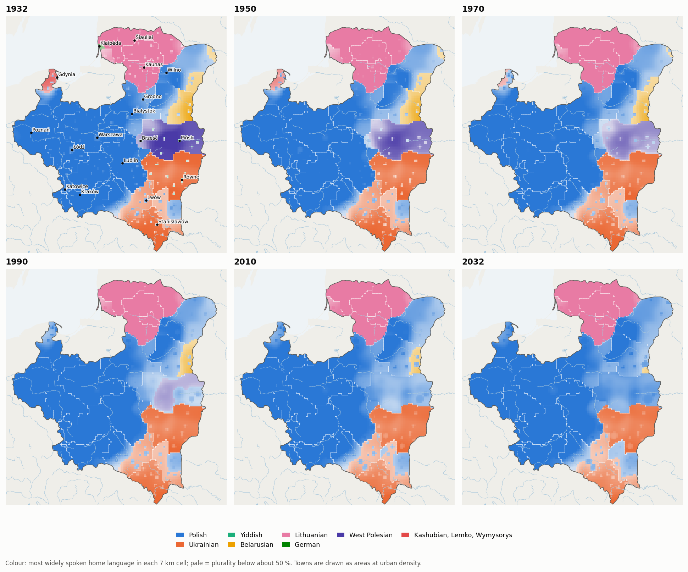
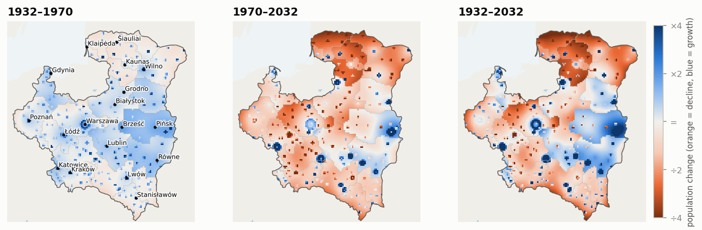
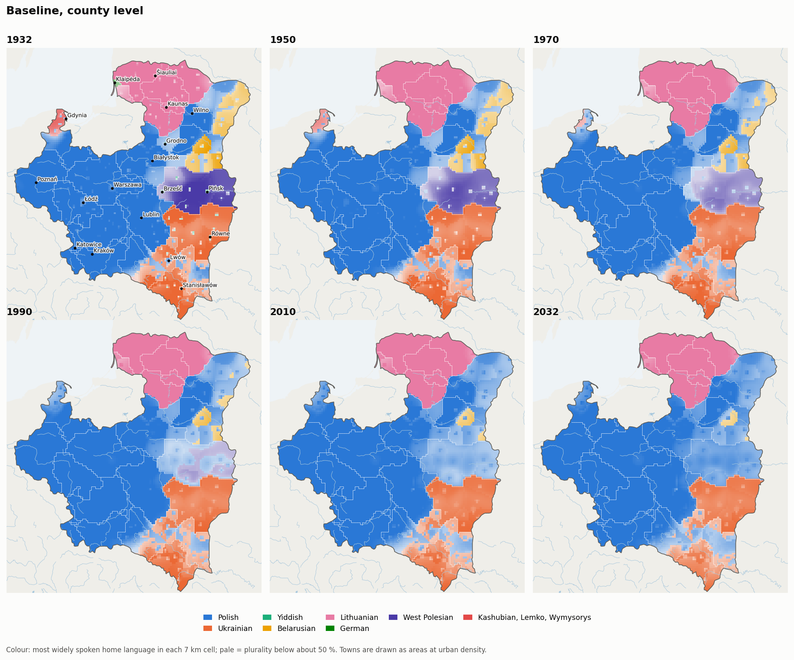

# plsim: Poland-Lithuania without the Second World War, 1932-2032

`plsim` is a coupled simulation of a surviving interwar Polish state (by
default in a federal union with Lithuania) in a world with no Second World
War. It models four things together:

* **Demography**: cohort-component projection by region, urban/rural,
  ethno-confessional community, language, sex and single year of age.
* **Migration**: rural-urban, inter-regional and international flows,
  including planned eastern settlement and Jewish and German emigration
  channels.
* **Language**: intergenerational and adult language shift, bilingualism,
  extinction of small languages, and what different censuses *would have
  recorded*.
* **Infrastructure**: endogenous growth of the railway and road networks
  under budgets, cost-benefit appraisal and the dated 1930s projects and 1939
  plans.

The simulation starts from the census of 9 December 1931, is back-validated
against the registered statistics of 1932-1939, and then runs forward without
the war. It is a counterfactual *simulation*, not a forecast. Each component
uses a published model structure; see `docs/METHODOLOGY.md` for equations,
calibration, sources and limitations.

## Quick start

```bash
pip install -r requirements.txt
python -m plsim list                    # scenarios
python -m plsim run baseline            # one seeded run -> outputs/runs/baseline/*.csv (+ validation)
python -m plsim validate baseline       # 1932-39 back-validation and plausibility checks
python -m plsim census                  # 1931 census-reconstruction consistency test
python -m plsim ensemble baseline -n 32 # Monte-Carlo ensemble -> outputs/ensemble_baseline/*.csv
python -m plsim report -n 32            # all scenarios + ensembles + figures + outputs/report.html
python -m plsim maps                    # 7 km maps, GIF animations and the interactive atlas (outputs/atlas/)
python -m plsim run baseline_counties   # the baseline on the 1931 counties (about 4 minutes)
pytest -q                               # 67 tests
```

A 100-year run takes about 20 s (about 4 minutes at county level). The
full report takes about 17 minutes on 4 cores, half of it for the two
county-level scenarios.

## What is modelled

| Area | Model | Main references |
|---|---|---|
| Starting population | 1931 census cross-read with religion; Lithuania 1923/1925 censuses; three reconstructions of the latent vernacular; 1897 imperial census anchors | GUS 1931; Tomaszewski 1985; Kubijovyč 1983; 1897 census |
| Mortality | Siler age pattern with a health-progress index; best-practice-gap level with a post-1945 catch-up jump | Oeppen & Vaupel 2002; Preston 1975; Raftery et al. 2013 |
| Fertility | three-phase TFR model (double-logistic Phase II, AR(1) Phase III), pace driven by modernisation and community | Alkema et al. 2011; Coale & Watkins 1986 |
| Migration | Rogers-Castro age schedules; income-driven urbanisation; spatial interaction over *network* travel times; migration hump | Rogers & Castro 1981; Wilson 1971; Harris & Todaro 1970; Hatton & Williamson 1998 |
| Language | multi-language Abrams-Strogatz attraction with a bilingual state, vertical and horizontal transmission, enclave concentration, institutional completeness, a census observation model | Abrams & Strogatz 2003; Minett & Wang 2008; Kandler et al. 2010; Breton 1964 |
| Networks | ~190-node multimodal graph; gravity demand; rule-of-half appraisal with the exact single-edge update; budgets; dated historical and planned projects; Beeching-type closures | Yerra & Levinson 2005; Louf et al. 2013; Donaldson & Hornbeck 2016 |
| Economy (driver) | conditional convergence to a western frontier; regional A/B gradient; COP and Fifteen-Year Plan; Gompertz motorisation | Barro & Sala-i-Martin 1992; Dargay & Gately 1999 |

## Census unreliability, the imperial census and the Lauda question

The 1931 census is itself contested evidence, so the model keeps *what people
spoke at home* separate from *what a census printed*.

* **Starting points** (`census_variant`):
  * `official`: the 1931 census as printed.
  * `religion_corrected`: Tomaszewski-style. It reproduces his ~64.7 % ethnic
    Poles.
  * `vernacular`: the upper bound for minority speech, anchored on the 1897
    imperial Russian native-language census.
* **Lithuania's Polish-speakers** (`lt_variant`): 65.6 k in the 1923 census,
  the ~202 k Polish claim of 1923, or the ~9 % Polish share of the 1897 Kovno
  governorate.
* **Census observation model.** It re-expresses any latent state as a
  1931-type Polish census, the 1897 imperial census, the 1923 Lithuanian
  census or a modern self-identification census would have recorded it.
  Passing the corrected reconstructions through the 1931 regime reproduces
  the printed national shares to within 2-3 points in total. In other words,
  the published census is consistent with a considerably less Polish-speaking
  population.
* **Lauda** (Kėdainiai-Panevėžys-Ukmergė-Raseiniai) is its own unit. The
  Polish-speaking petty gentry there survive under the federal bilingual
  baseline, are Lithuanised under `forced_lithuanization`, and Polish spreads
  under a `polonizing_union`.

## Headline results (baseline, 32-member ensemble)

Medians, with 5-95 % ranges in brackets. The whole union is 17 Polish units
plus 6 Lithuanian units.

| Year | Population (M) | TFR | e0 m / f | Urban % | GDP/head (1990 GK$) |
|---|---|---|---|---|---|
| 1939 | 37.2 (Poland 34.6) | 3.27 | 50.7 / 54.3 | 28 | 2,070 |
| 1960 | 44.5 [43.1-46.2] | 2.91 | 59.4 / 64.3 | 39 | 3,830 |
| 1990 | 51.0 [46.8-55.9] | 1.91 | 68.1 / 74.6 | 57 | 9,500 |
| 2032 | 51.8 [43.0-63.0] | 1.58 | 79.5 / 84.3 | 67 | 18,200 |

**Demography**

* The population peaks at ~53 M around 2014.
* The Polish voivodeships alone reach ~49-50 M (the Second Republic alone:
  48.3 M [39-61] in 2032).
* Net emigration of ~100-120 k/yr in the guest-worker era gives way to net
  immigration only in the high-convergence runs.

**Languages** (home vernacular, shares of the whole union)

| Language | 1933 | 2032 |
|---|---|---|
| Polish | 63.8 % | 67.4 % |
| Ukrainian | 12.7 % | 16.3 % (~8.4 M speakers, roughly doubling) |
| Yiddish | 8.2 % | 4.5 % |
| Belarusian | 2.9 % | 2.6 % |
| Lithuanian | 5.9 % | 4.4 % |

* **Ukrainian** grows faster than the population as a whole: high Galician
  and Volhynian fertility plus robust Greek-Catholic institutions.
* **Yiddish** declines among acculturating Jews, from 78 % Yiddish-speaking
  in 1935 to 12 % in 2030. It survives through a growing Haredi population
  (~1.7 M in 2030; very uncertain).
* **Kashubian**: 200 k -> 115 k [77-165 k].
* **Lemko**: 120 k -> 106 k.
* **West Polesian**: persists in villages (0.9 M) as a declining share.
* **Wymysorys**: 1,500 -> ~60 speakers, moribund even without the post-war
  ban.
* **Karaim**: ~680 -> ~230 speakers.

**Infrastructure**

* Almost all inter-town roads are paved by ~1960.
* By 2032: ~6,400 km of motorway, 9,600 km of expressway, ~10,300 km of
  electrified trunk railway and ~1,000 km of high-speed line.
* The 1939 plans are completed in the early 1940s: the Wilno-Gdynia shortcut
  Łapy-Ostrołęka-Przasnysz-Mława, Dębica-Jasło, and the COP Łódź-Dębica
  trunk.

## Maps: language shift and population on a 7 km grid

`python -m plsim maps` downscales every scenario to 9,383 cells of about
7 x 7 km and draws the result:

* **Interactive atlas**: `outputs/atlas/index.html`. It has a time slider,
  15 scenarios (two of them at county level), and four layers: plurality
  language, one language (optionally as change since 1932), density and
  growth. It overlays the
  railway and road network as it grows, with km by class and the latest
  openings, and dashes the borders between federal members (cantons,
  autonomies). It also reads out any cell.
* **Static maps and animations**: `outputs/maps/`, including
  `anim_languages.gif` and `anim_density.gif`.

How it works (details in `docs/METHODOLOGY.md` §12):

* **Territory.** The state borders are those of 1 January 1932, from
  CShapes 2.0 (Schvitz et al. 2022). Maps clip the cells to them, so the
  border is drawn as a line rather than in 7 km steps. Voivodeship borders
  inside are approximations (weighted Voronoi of the towns, calibrated to
  the official areas).
* **1932.** County anchors from the 1931 census, 25 of them county figures,
  the rest graded estimates, shape each voivodeship's languages inside its
  borders. Iterative proportional fitting keeps the regional totals exact.
* **Each year.** The region's net shift from the main model is placed with
  the neighbourhood rule of Prochazka & Vogl (2017, *PNAS*): speakers shift
  where the gaining language is spoken nearby (Gaussian kernel, 10 km),
  plus a constant institutional part. Towns spread their influence over a
  wider radius as they grow (Trudgill's hierarchical diffusion). Language
  islands therefore dissolve first, and contact zones retreat as fronts.
* **Population.** Rural cells near growing towns gain population and remote
  ones lose it, which gives suburban rings and rural exodus.



Baseline, area where each language leads (thousand km²):

| | Polish | Ukrainian | Lithuanian | Belarusian | West Polesian | Kashubian/Lemko |
|---|---|---|---|---|---|---|
| 1932 | 255 | 75 | 55 | 17 | 35 | 4 |
| 2032 | 319 | 67 | 56 | 1 | 0 | 0 |
| 1932, county run | 251 | 74 | 55 | 21 | 35 | 4 |
| 2032, county run | 320 | 65 | 56 | 2 | 0 | 0 |

* **Ukrainian** holds its Volhynian and Pokuttya core. It retreats from the
  San and the Lwów hinterland.
* **Belarusian and West Polesian** survive as minorities in the villages,
  but lead almost nowhere by 2032. In the "Ukrainian autonomy" scenario
  (with Belarusian schooling) and the two alternative 1931 starting points,
  Belarusian still leads along the eastern border.
* **Population.** Two-thirds of the land area has fewer people in 2032 than
  in 1932, and a fifth has less than half. Growth concentrates in the
  cities, their suburban rings, and high-fertility Polesie and Volhynia.



## County level (powiaty)

`partition: counties` runs the model on 270 regions instead of 23
voivodeships. These are the 1931 powiaty and the Lithuanian apskritys,
with Warsaw and Kaunas cities whole. One county, Węgrów, wins no cell on
the approximate voivodeship map and is merged into its neighbours. Two scenarios use it:
`baseline_counties` and `ukraine_autonomy_tricantonal_counties`. Details
are in `docs/METHODOLOGY.md` §12.6.

* **Data.** The 1931 county census by mother tongue covers the eight
  eastern voivodeships (97 counties, grade A). Lublin has county
  populations (grade B). The other counties have seats only and are
  downscaled from their voivodeship (grade C). County figures are fitted
  to the voivodeship totals of the chosen census variant.
* **Consistency.** Migration, income, enclave concentration and random
  numbers are nested in the voivodeships, so the county run reproduces
  the voivodeship model:

  | 2032 | Voivodeship run | County run |
  |---|---|---|
  | Population | 48.25 M | 48.15 M |
  | Ukrainian speakers | 8.17 M | 8.20 M |
  | Belarusian speakers | 1.39 M | 1.40 M |

  Every voivodeship's 2032 language shares are within about a point.
  Without the nesting, the cities stopped growing (Warsaw 1.06× instead of
  2.4×).
* **What it adds is where.**
  * **Baseline.** 34 counties change plurality language by 2032: the
    Belarusian blocks of Głębokie–Wilejka and Nieśwież–Słonim, all nine
    Polesie counties, three Kashubian counties, and fifteen Ukrainian
    counties of Lwów and Tarnopol turn Polish. Lwów county grows from
    460 k to 829 k, Wilno from 415 k to 782 k.
  * **Ukrainian autonomy + cantons.** It runs the other way. Ukrainian
    gains 13 counties, including Tarnopol and Złoczów. Belarusian goes
    from 6 to 18 of the Belarusian canton's 20 counties. Polish keeps the
    counties west of the San and Lwów itself.
* **Cost.** A run takes about 4 minutes, against 25 s for the voivodeship
  model.



## Scenarios (single seeded run each, 2032)

| Scenario | Polish-unit pop. (M) | Polish % | Ukrainian % | Yiddish % | Belarusian % | Lithuanian % | W. Polesian (k) |
|---|---|---|---|---|---|---|---|
| baseline | 46.2 | 67.5 | 16.9 | 3.9 | 2.9 | 4.4 | 950 |
| baseline_counties | 46.1 | 67.4 | 17.0 | 3.9 | 2.9 | 4.3 | 923 |
| ii_rp_only | 46.3 | 70.3 | 17.9 | 4.1 | 3.1 | 0.2 | 993 |
| federal_autonomy | 46.2 | 62.6 | 18.2 | 4.6 | 4.2 | 4.4 | 1,570 |
| integral_nationalism | 45.7 | 71.5 | 15.7 | 3.2 | 2.1 | 4.3 | 547 |
| forced_lithuanization | 46.2 | 67.4 | 16.9 | 3.9 | 2.9 | 4.5 | 949 |
| polonizing_union | 46.1 | 67.9 | 16.9 | 3.9 | 2.9 | 3.9 | 949 |
| census_religion_corrected | 46.2 | 64.9 | 18.5 | 3.9 | 3.9 | 4.3 | 951 |
| census_vernacular | 46.3 | 64.2 | 19.0 | 3.9 | 4.2 | 4.2 | 951 |
| finnish_path | 49.1 | 67.8 | 16.4 | 3.8 | 2.7 | 4.3 | 915 |
| stagnation | 39.0 | 65.7 | 17.2 | 4.4 | 3.1 | 4.6 | 1,006 |
| ukraine_autonomy_tricantonal | 45.7 | 59.4 | 18.2 | 4.5 | 7.9 | 4.4 | 1,339 |
| ukraine_autonomy_tricantonal_rc | 45.7 | 56.0 | 19.9 | 4.5 | 9.6 | 4.4 | 1,341 |
| ukraine_autonomy_tricantonal_counties | 45.6 | 59.5 | 18.3 | 4.5 | 7.8 | 4.4 | 1,328 |

Polish-speakers in the Lithuanian units in 2032:

| Scenario | Polish-speakers (from ~80 k in 1932) |
|---|---|
| baseline (federal) | ~70 k |
| forced_lithuanization | ~28 k |
| polonizing_union | ~310 k |
| starting from the 1923 Polish claim | 181 k -> ~140 k |
| Ukrainian autonomy + tri-cantonal Grand Duchy (Polish schools in the Lithuanian canton) | ~130 k |

**Ukrainian autonomy + tri-cantonal Lithuania.** Lwów, Tarnopol and
Stanisławów voivodeships plus Volhynia form a Ukrainian autonomy, on the
never-implemented 1922 statute. Everything east of the later Curzon line and
north of Volhynia joins Lithuania as a Grand Duchy of Lithuanian, Polish
(Wilno–Lida–Grodno) and Belarusian (eastern Wilno lands, Nowogródek,
Polesie) cantons. Voivodeships are split along county lines for this, via
the 7 km grid. By 2032:

* Belarusian speakers number 3.8 M (1.4 M in the baseline). Belarusian
  becomes the plurality language of its canton (27 → 49 %).
* Ukrainian rises from 51 to 65 % of the autonomy. Tarnopol turns
  Ukrainian-plurality; west of the San stays Polish (60 %).
* Polish falls to 59 % of the union.

The full table is in `outputs/scenario_summary.csv`; the assumptions are in
`docs/SCENARIOS.md`. Proposed further developments are in `docs/ROADMAP.md`.

## Repository layout

```
plsim/
  data/regions.py        23 spatial units (1931 voivodeships + Lithuanian units)
  data/languages.py      languages, communities, (community, language) groups, shift targets
  data/census1931.py     1931 / 1923 / 1897-anchored reconstructions, bilingual shares
  data/network.py        towns, c.1931 rail network, paved roads, dated & planned projects
  demography.py          life tables, e0 frontier model, Alkema TFR, schedules, initial ages
  migration.py           Rogers-Castro, urbanisation, spatial interaction, migration hump
  language.py            transmission, enclaves, institutions, census observation model
  infrastructure.py      network, travel times, gravity demand, appraisal, investment
  economy.py             convergence, regional incomes, motorisation, budgets
  model.py               the annual simulation loop
  ensemble.py            Monte-Carlo parameter sampling and summaries
  validate.py            1932-39 back-validation and plausibility checks
  report.py, export.py   figures, CSVs, HTML report
  data/geography.py      7 km grid, 1932 state borders, county language anchors (1931)
  data/borders_1932.json Poland and Lithuania on 1 Jan 1932 (CShapes 2.0)
  data/subregions.py     county-line splits of voivodeships (Curzon line, cantons, the San)
  data/counties.py       269 counties (1931 powiaty, 1923 apskritys) with graded census rows
  partition.py           1931 population of sub-regions and counties, via the grid
  data/geo_base.json     coastline, lakes and rivers (GSHHS via basemap-data)
  spatial.py             downscaling + neighbourhood (Prochazka-Vogl) language-shift allocation
  maps.py, webmap.py     static maps, GIF animations, interactive atlas data
  atlas_template.html    the interactive atlas page
  cli.py                 command-line interface
scenarios/*.yaml         16 scenarios (extends/override)
docs/                    METHODOLOGY, DATA_SOURCES (with reliability grades), SCENARIOS, ROADMAP
outputs/                 report.html, figures/, maps/, atlas/, scenario_summary.csv, ensemble CSVs, baseline run CSVs
tests/                   census reconstruction, demography, language, network, model accounting
```

## Caveats

This is not a prediction of what "would have happened". The 1930s are
anchored to data. Everything after depends on explicit and adjustable
assumptions:

* **Political assumptions** (federalism vs. nationalism, the union with
  Lithuania, the growth path) are scenarios.
* **Parameter uncertainty** is sampled in the ensembles.
* **Weakest parts**: the fate of Jewish emigration and Haredi fertility in a
  world without the Holocaust; regional starting data graded "C" in
  `docs/DATA_SOURCES.md`; the stylised transport network.
